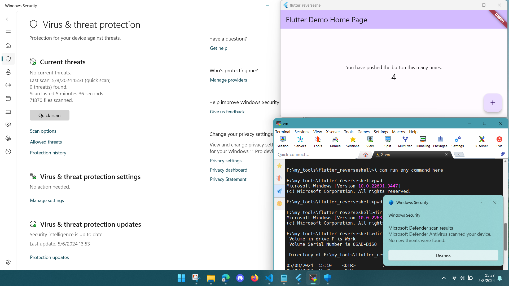

## Fully Undetectable Reverse Shell (FUD)

This is a fully undetectable reverse shell written in Dart.

* This project is for educational purposes only. *

## Features
- Fully undetectable
- No port forwarding required
